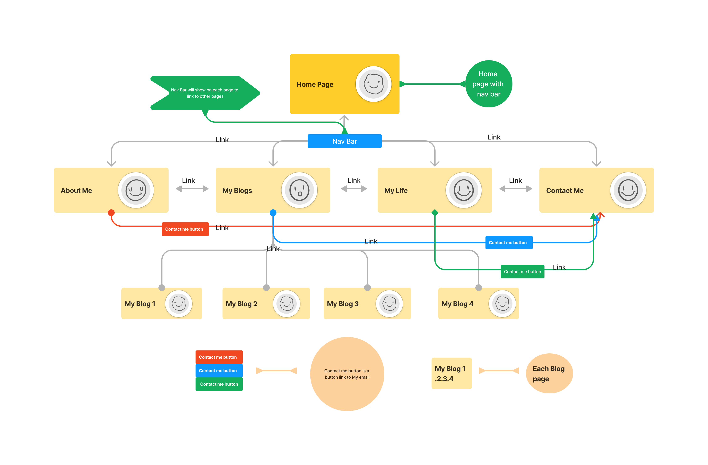
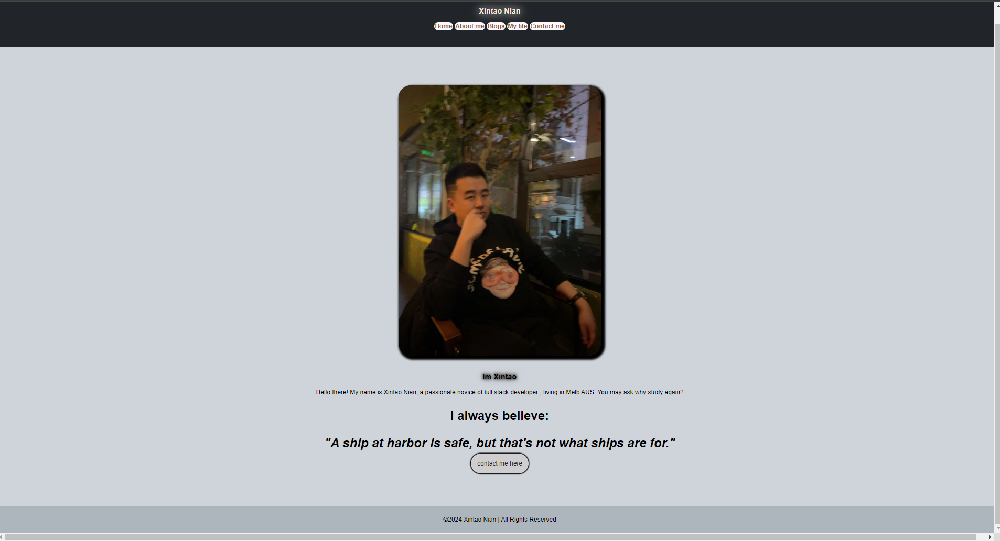
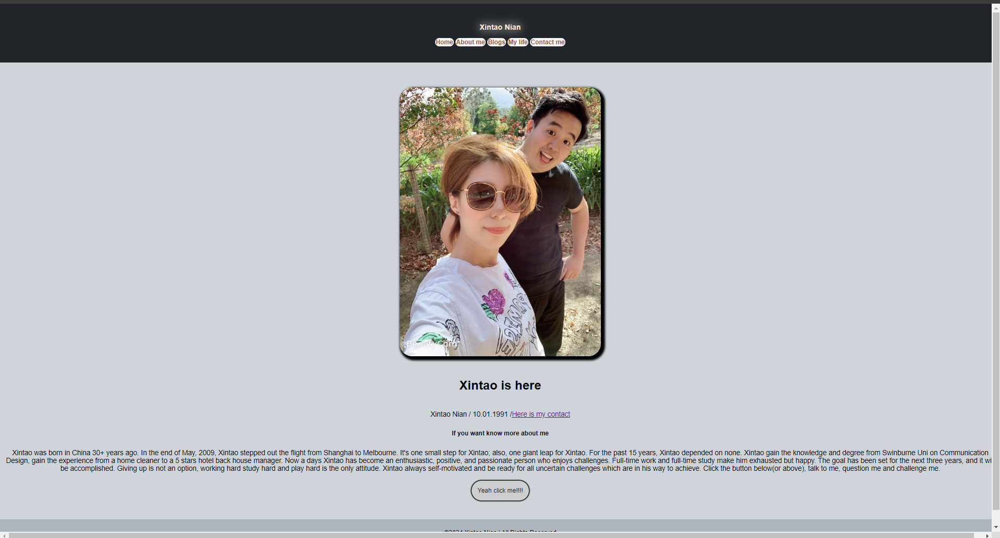
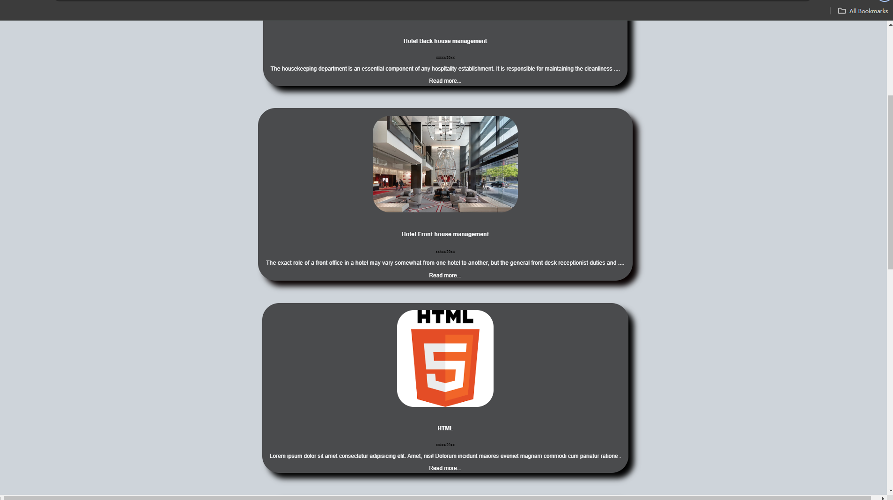
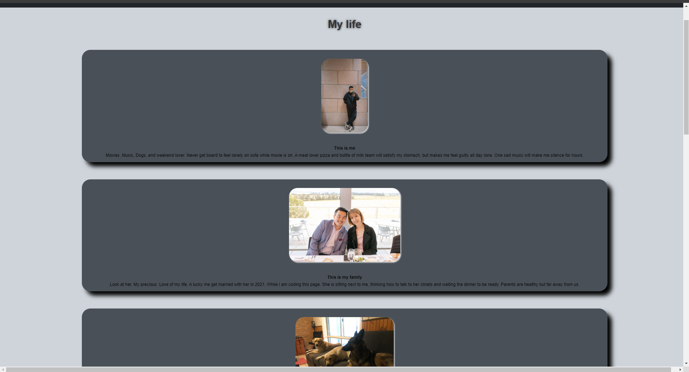
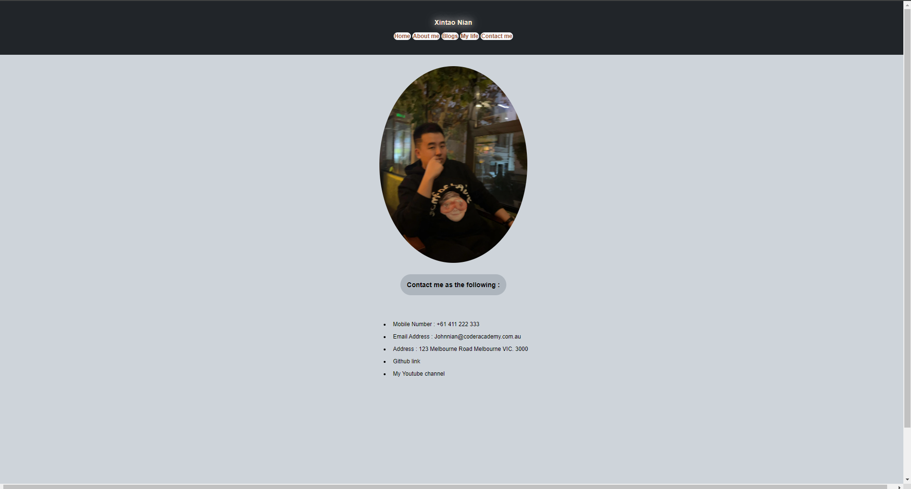

# Xintaonian-Portfolio

## Portfolio Website URL: 
<https://xintaonianportfolio.netlify.app>

## GitHub Repository URL:
<https://github.com/Nianxintao/Xintaonian-Portfolio>

## Presentation Video URL:
<https://www.youtube.com/channel/UC8e-W9ITpnXESGD2dRzZsMA>

# Purpose
The T1A2 portfolio assignment is to approve that the basic acknowlage of HTML and CSS gained from the first 5 weeks learning. Alson a showcase my accomplishments, projects, experiences as an aspiring web developer.

# Target Audience
 An employer looking to engage a dev and/or IT professional.

# Functionality / features
1. NavBar
The navigation bar on the top  of the page allows everyone to navigate around the website to view every pages. It assists users of the Home Page, About Me Page, Blogs, the Contact me and each blog pages.
2. Conatct me button
The contact me button on Home and About me pages will lead the users to the Contact me page dirctely. 
3. Check my Resume button
The Check my Resume button will allow users to download my resume to their local machine.
4. Read more button:
The read more button will lead the user to the new my page about the each blog page.
5. hover: for most of sections (cards) on each page. Pop up the content grom the origin layout. 

# sitemap

The Nav bar will take the users to all the pages. 
Contact buttone will take you to Contact me page.
My blogs contain each blog pages which can not me access from other pages but only from My blogs page.

# Wireframes
## Mobile view
***There are small changes between final work and wireframe***
### 1. Home Page
.png>)

### 2. About me page
.png>)

### 3. Blog list Page
.png>)

#### 4. Each Blog page
.png>)

#### 5. My life page
.png>)
.png>)
#### 6. Contact me page
.png>)

## Desktopview
***There are small changes between final work and wireframe***
### 1. Home Page

### 2. About me page

### 3. Blog list Page

#### 4. Each Blog page

#### 5. My life page

#### 6. Contact me page

# Tech Stack
- HTML
- CSS
- GitHub
- Figma
- VSCode
- Github
- Netlify

